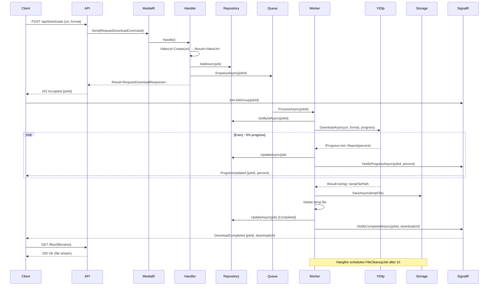

# Video Downloader API — Architecture Document

## 1. Overview

A REST API built with ASP.NET Core Minimal APIs (.NET 8) that accepts video URLs from major platforms (YouTube, Instagram, TikTok, Twitter/X) and returns downloadable MP4 or MP3 files.

### Main Architectural Decisions

- **Clean Architecture**: strict dependency rule — outer layers depend on inner layers, never the reverse
- **CQRS (lightweight)**: Commands and Queries separated via MediatR, no separate read/write databases
- **Result pattern**: no exception-driven control flow; all use cases return `Result<T>`
- **Async queue via Hangfire**: downloads are enqueued as background jobs; clients track progress via SignalR
- **Abstracted storage**: `IStorageService` decouples file I/O from the domain; swappable to S3/Blob later

```
┌─────────────────────────────────────────────────┐
│                  Client (HTTP/WS)               │
└───────────────────┬─────────────────────────────┘
                    │ REST + SignalR
┌───────────────────▼─────────────────────────────┐
│              API Layer (Presentation)            │
│         Minimal APIs · Middleware · SignalR      │
└───────────────────┬─────────────────────────────┘
                    │ MediatR
┌───────────────────▼─────────────────────────────┐
│             Application Layer                    │
│      Commands · Queries · DTOs · Interfaces      │
└──────────┬────────────────────┬─────────────────┘
           │                    │
┌──────────▼──────┐   ┌─────────▼───────────────┐
│  Domain Layer   │   │   Infrastructure Layer   │
│ Entities · VOs  │   │ yt-dlp · Storage · Queue │
│ Domain Services │   │ Hangfire · Serilog        │
└─────────────────┘   └─────────────────────────┘
```

---

## 2. Folder Structure

```
VideoDownloaderApi/
├── src/
│   ├── VideoDownloader.Domain/          # Enterprise business rules
│   │   ├── Entities/
│   │   ├── ValueObjects/
│   │   ├── Enums/
│   │   ├── Errors/
│   │   └── Interfaces/
│   │
│   ├── VideoDownloader.Application/     # Application business rules
│   │   ├── Downloads/
│   │   │   ├── Commands/
│   │   │   └── Queries/
│   │   ├── Common/
│   │   │   ├── Behaviors/              # MediatR pipeline behaviors
│   │   │   ├── DTOs/
│   │   │   └── Interfaces/
│   │   └── DependencyInjection.cs
│   │
│   ├── VideoDownloader.Infrastructure/  # External concerns
│   │   ├── YtDlp/                      # yt-dlp wrapper
│   │   ├── Storage/                    # File system implementation
│   │   ├── Queue/                      # Hangfire jobs
│   │   ├── RealTime/                   # SignalR hub
│   │   ├── RateLimiting/
│   │   └── DependencyInjection.cs
│   │
│   └── VideoDownloader.Api/            # Entry point
│       ├── Endpoints/
│       ├── Middleware/
│       ├── Hubs/
│       ├── Contracts/
│       ├── Program.cs
│       └── appsettings.json
│
└── tests/
    ├── VideoDownloader.Domain.Tests/
    ├── VideoDownloader.Application.Tests/
    └── VideoDownloader.Api.Tests/
```

---

## 3. Layers & Responsibilities

| Layer | Responsibility | Allowed Dependencies |
|-------|---------------|----------------------|
| **Domain** | Core business rules, entities, value objects | None (pure C#) |
| **Application** | Orchestrates use cases, defines interfaces | Domain |
| **Infrastructure** | Implements interfaces (yt-dlp, storage, queue) | Application, Domain |
| **API** | HTTP endpoints, SignalR hubs, middleware | Application |

The **Dependency Inversion Principle** is enforced: `Infrastructure` and `API` depend on `Application` interfaces, never the other way around.

---

## 4. Core Domain

### Entities

```csharp
// Domain/Entities/DownloadJob.cs
public sealed class DownloadJob
{
    public Guid Id { get; private set; }
    public VideoUrl Url { get; private set; }
    public DownloadFormat Format { get; private set; }
    public DownloadStatus Status { get; private set; }
    public int ProgressPercent { get; private set; }
    public string? OutputFilePath { get; private set; }
    public string? ErrorMessage { get; private set; }
    public DateTimeOffset CreatedAt { get; private set; }
    public DateTimeOffset? CompletedAt { get; private set; }

    private DownloadJob() { }

    public static DownloadJob Create(VideoUrl url, DownloadFormat format)
        => new()
        {
            Id = Guid.NewGuid(),
            Url = url,
            Format = format,
            Status = DownloadStatus.Queued,
            CreatedAt = DateTimeOffset.UtcNow
        };

    public void UpdateProgress(int percent)
    {
        if (percent is < 0 or > 100) throw new ArgumentOutOfRangeException(nameof(percent));
        ProgressPercent = percent;
        Status = DownloadStatus.Processing;
    }

    public void Complete(string filePath)
    {
        OutputFilePath = filePath;
        Status = DownloadStatus.Completed;
        CompletedAt = DateTimeOffset.UtcNow;
        ProgressPercent = 100;
    }

    public void Fail(string reason)
    {
        ErrorMessage = reason;
        Status = DownloadStatus.Failed;
        CompletedAt = DateTimeOffset.UtcNow;
    }
}
```

### Value Objects

```csharp
// Domain/ValueObjects/VideoUrl.cs
public sealed record VideoUrl
{
    public string Value { get; }
    public Platform Platform { get; }

    private static readonly IReadOnlyDictionary<string, Platform> PlatformMap = new Dictionary<string, Platform>
    {
        ["youtube.com"] = Platform.YouTube,
        ["youtu.be"]    = Platform.YouTube,
        ["instagram.com"] = Platform.Instagram,
        ["tiktok.com"]  = Platform.TikTok,
        ["twitter.com"] = Platform.Twitter,
        ["x.com"]       = Platform.Twitter,
    };

    private VideoUrl(string value, Platform platform)
    {
        Value = value;
        Platform = platform;
    }

    public static Result<VideoUrl> Create(string raw)
    {
        if (string.IsNullOrWhiteSpace(raw))
            return Result.Failure<VideoUrl>(DomainErrors.VideoUrl.Empty);

        if (!Uri.TryCreate(raw, UriKind.Absolute, out var uri))
            return Result.Failure<VideoUrl>(DomainErrors.VideoUrl.Invalid);

        var host = uri.Host.Replace("www.", "");
        if (!PlatformMap.TryGetValue(host, out var platform))
            return Result.Failure<VideoUrl>(DomainErrors.VideoUrl.UnsupportedPlatform);

        return Result.Success(new VideoUrl(raw, platform));
    }
}
```

### Enums

```csharp
public enum DownloadFormat { Mp4, Mp3 }
public enum DownloadStatus { Queued, Processing, Completed, Failed }
public enum Platform { YouTube, Instagram, TikTok, Twitter }
```

### Domain Errors

```csharp
// Domain/Errors/DomainErrors.cs
public static class DomainErrors
{
    public static class VideoUrl
    {
        public static readonly Error Empty = new("VideoUrl.Empty", "URL cannot be empty.");
        public static readonly Error Invalid = new("VideoUrl.Invalid", "URL format is invalid.");
        public static readonly Error UnsupportedPlatform = new("VideoUrl.UnsupportedPlatform", "Platform not supported.");
    }

    public static class DownloadJob
    {
        public static readonly Error NotFound = new("DownloadJob.NotFound", "Download job not found.");
    }
}

public sealed record Error(string Code, string Message)
{
    public static readonly Error None = new(string.Empty, string.Empty);
}
```

### Domain Interfaces

```csharp
// Domain/Interfaces/IDownloadJobRepository.cs
public interface IDownloadJobRepository
{
    Task<DownloadJob?> GetByIdAsync(Guid id, CancellationToken ct = default);
    Task AddAsync(DownloadJob job, CancellationToken ct = default);
    Task UpdateAsync(DownloadJob job, CancellationToken ct = default);
}
```

---

## 5. Application Layer

### Result Pattern

```csharp
// Application/Common/Result.cs
public sealed class Result<T>
{
    public T? Value { get; }
    public Error Error { get; }
    public bool IsSuccess { get; }
    public bool IsFailure => !IsSuccess;

    private Result(T value) { Value = value; IsSuccess = true; Error = Error.None; }
    private Result(Error error) { Error = error; IsSuccess = false; }

    public static Result<T> Success(T value) => new(value);
    public static Result<T> Failure(Error error) => new(error);

    public TOut Match<TOut>(Func<T, TOut> onSuccess, Func<Error, TOut> onFailure)
        => IsSuccess ? onSuccess(Value!) : onFailure(Error);
}

public static class Result
{
    public static Result<T> Success<T>(T value) => Result<T>.Success(value);
    public static Result<T> Failure<T>(Error error) => Result<T>.Failure(error);
}
```

### CQRS — Commands

```csharp
// Application/Downloads/Commands/RequestDownload/RequestDownloadCommand.cs
public sealed record RequestDownloadCommand(string Url, string Format)
    : IRequest<Result<RequestDownloadResponse>>;

// Application/Downloads/Commands/RequestDownload/RequestDownloadHandler.cs
public sealed class RequestDownloadHandler(
    IDownloadJobRepository repository,
    IDownloadQueue queue)
    : IRequestHandler<RequestDownloadCommand, Result<RequestDownloadResponse>>
{
    public async Task<Result<RequestDownloadResponse>> Handle(
        RequestDownloadCommand request, CancellationToken ct)
    {
        var urlResult = VideoUrl.Create(request.Url);
        if (urlResult.IsFailure)
            return Result.Failure<RequestDownloadResponse>(urlResult.Error);

        if (!Enum.TryParse<DownloadFormat>(request.Format, ignoreCase: true, out var format))
            return Result.Failure<RequestDownloadResponse>(
                new Error("Format.Invalid", $"Format '{request.Format}' is not supported."));

        var job = DownloadJob.Create(urlResult.Value!, format);

        await repository.AddAsync(job, ct);
        await queue.EnqueueAsync(job.Id, ct);

        return Result.Success(new RequestDownloadResponse(job.Id, job.Status.ToString()));
    }
}
```

### CQRS — Queries

```csharp
// Application/Downloads/Queries/GetVideoMetadata/GetVideoMetadataQuery.cs
public sealed record GetVideoMetadataQuery(string Url)
    : IRequest<Result<VideoMetadataResponse>>;

public sealed class GetVideoMetadataHandler(IVideoMetadataService metadataService)
    : IRequestHandler<GetVideoMetadataQuery, Result<VideoMetadataResponse>>
{
    public async Task<Result<VideoMetadataResponse>> Handle(
        GetVideoMetadataQuery request, CancellationToken ct)
    {
        var urlResult = VideoUrl.Create(request.Url);
        if (urlResult.IsFailure)
            return Result.Failure<VideoMetadataResponse>(urlResult.Error);

        return await metadataService.GetMetadataAsync(urlResult.Value!, ct);
    }
}
```

### DTOs

```csharp
public sealed record RequestDownloadResponse(Guid JobId, string Status);

public sealed record VideoMetadataResponse(
    string Title,
    string ThumbnailUrl,
    TimeSpan Duration,
    IReadOnlyList<FormatInfo> AvailableFormats);

public sealed record FormatInfo(string Id, string Extension, string Quality, long? FileSizeBytes);

public sealed record DownloadJobStatusResponse(
    Guid JobId,
    string Status,
    int ProgressPercent,
    string? DownloadUrl,
    string? ErrorMessage);
```

### Application Interfaces

```csharp
public interface IVideoMetadataService
{
    Task<Result<VideoMetadataResponse>> GetMetadataAsync(VideoUrl url, CancellationToken ct = default);
}

public interface IVideoDownloadService
{
    Task<Result<string>> DownloadAsync(
        Guid jobId, VideoUrl url, DownloadFormat format,
        IProgress<int> progress, CancellationToken ct = default);
}

public interface IStorageService
{
    Task<string> SaveAsync(Stream content, string fileName, CancellationToken ct = default);
    Task DeleteAsync(string filePath, CancellationToken ct = default);
    string GetDownloadUrl(string filePath);
}

public interface IDownloadQueue
{
    Task EnqueueAsync(Guid jobId, CancellationToken ct = default);
}

public interface IProgressNotifier
{
    Task NotifyProgressAsync(Guid jobId, int percent, CancellationToken ct = default);
    Task NotifyCompletedAsync(Guid jobId, string downloadUrl, CancellationToken ct = default);
    Task NotifyFailedAsync(Guid jobId, string reason, CancellationToken ct = default);
}
```

### MediatR Pipeline Behaviors

```csharp
// Application/Common/Behaviors/ValidationBehavior.cs
public sealed class ValidationBehavior<TRequest, TResponse>(
    IEnumerable<IValidator<TRequest>> validators)
    : IPipelineBehavior<TRequest, TResponse>
    where TRequest : notnull
{
    public async Task<TResponse> Handle(
        TRequest request, RequestHandlerDelegate<TResponse> next, CancellationToken ct)
    {
        if (!validators.Any()) return await next();

        var context = new ValidationContext<TRequest>(request);
        var failures = validators
            .Select(v => v.Validate(context))
            .SelectMany(r => r.Errors)
            .Where(f => f is not null)
            .ToList();

        if (failures.Count != 0)
            throw new ValidationException(failures);

        return await next();
    }
}

// Application/Common/Behaviors/LoggingBehavior.cs
public sealed class LoggingBehavior<TRequest, TResponse>(ILogger<LoggingBehavior<TRequest, TResponse>> logger)
    : IPipelineBehavior<TRequest, TResponse>
    where TRequest : notnull
{
    public async Task<TResponse> Handle(
        TRequest request, RequestHandlerDelegate<TResponse> next, CancellationToken ct)
    {
        var name = typeof(TRequest).Name;
        logger.LogInformation("Handling {RequestName}", name);
        var response = await next();
        logger.LogInformation("Handled {RequestName}", name);
        return response;
    }
}
```

---

## 6. Infrastructure Layer

### yt-dlp Integration

```csharp
// Infrastructure/YtDlp/YtDlpVideoService.cs
public sealed class YtDlpVideoService(
    IOptions<YtDlpOptions> options,
    ILogger<YtDlpVideoService> logger)
    : IVideoMetadataService, IVideoDownloadService
{
    private readonly string _ytDlpPath = options.Value.ExecutablePath;

    public async Task<Result<VideoMetadataResponse>> GetMetadataAsync(VideoUrl url, CancellationToken ct)
    {
        try
        {
            var json = await RunYtDlpAsync(
                ["--dump-json", "--no-download", url.Value], ct);

            var doc = JsonDocument.Parse(json);
            var root = doc.RootElement;

            var formats = root.GetProperty("formats").EnumerateArray()
                .Select(f => new FormatInfo(
                    f.GetProperty("format_id").GetString()!,
                    f.GetProperty("ext").GetString()!,
                    f.TryGetProperty("quality", out var q) ? q.ToString() : "unknown",
                    f.TryGetProperty("filesize", out var fs) ? fs.GetInt64() : null))
                .ToList();

            return Result.Success(new VideoMetadataResponse(
                root.GetProperty("title").GetString()!,
                root.GetProperty("thumbnail").GetString()!,
                TimeSpan.FromSeconds(root.GetProperty("duration").GetDouble()),
                formats));
        }
        catch (Exception ex)
        {
            logger.LogError(ex, "Failed to fetch metadata for {Url}", url.Value);
            return Result.Failure<VideoMetadataResponse>(
                new Error("YtDlp.MetadataFailed", "Could not retrieve video metadata."));
        }
    }

    public async Task<Result<string>> DownloadAsync(
        Guid jobId, VideoUrl url, DownloadFormat format,
        IProgress<int> progress, CancellationToken ct)
    {
        var outputPath = Path.Combine(Path.GetTempPath(), $"{jobId}.%(ext)s");
        var args = format == DownloadFormat.Mp3
            ? ["-x", "--audio-format", "mp3", "-o", outputPath, url.Value]
            : ["-f", "bestvideo[ext=mp4]+bestaudio[ext=m4a]/mp4", "-o", outputPath, url.Value];

        try
        {
            await RunYtDlpWithProgressAsync(args, progress, ct);
            var finalPath = Directory.GetFiles(Path.GetTempPath(), $"{jobId}.*").FirstOrDefault();

            return finalPath is null
                ? Result.Failure<string>(new Error("YtDlp.OutputNotFound", "Download output file not found."))
                : Result.Success(finalPath);
        }
        catch (Exception ex)
        {
            logger.LogError(ex, "Download failed for job {JobId}", jobId);
            return Result.Failure<string>(new Error("YtDlp.DownloadFailed", ex.Message));
        }
    }

    private async Task<string> RunYtDlpAsync(string[] args, CancellationToken ct)
    {
        using var process = new Process
        {
            StartInfo = new ProcessStartInfo
            {
                FileName = _ytDlpPath,
                Arguments = string.Join(" ", args.Select(a => $"\"{a}\"")),
                RedirectStandardOutput = true,
                RedirectStandardError = true,
                UseShellExecute = false,
                CreateNoWindow = true
            }
        };
        process.Start();
        var output = await process.StandardOutput.ReadToEndAsync(ct);
        await process.WaitForExitAsync(ct);
        return output;
    }

    private async Task RunYtDlpWithProgressAsync(
        string[] args, IProgress<int> progress, CancellationToken ct)
    {
        using var process = new Process
        {
            StartInfo = new ProcessStartInfo
            {
                FileName = _ytDlpPath,
                Arguments = string.Join(" ", args.Select(a => $"\"{a}\"")),
                RedirectStandardOutput = true,
                RedirectStandardError = true,
                UseShellExecute = false,
                CreateNoWindow = true
            }
        };

        process.OutputDataReceived += (_, e) =>
        {
            if (e.Data is null) return;
            // Parse yt-dlp progress: "[download]  45.3% of ..."
            var match = Regex.Match(e.Data, @"\[download\]\s+(\d+\.?\d*)%");
            if (match.Success && double.TryParse(match.Groups[1].Value, out var pct))
                progress.Report((int)pct);
        };

        process.Start();
        process.BeginOutputReadLine();
        await process.WaitForExitAsync(ct);
    }
}
```

### Storage Service

```csharp
// Infrastructure/Storage/LocalStorageService.cs
public sealed class LocalStorageService(IOptions<StorageOptions> options)
    : IStorageService
{
    private readonly string _basePath = options.Value.BasePath;
    private readonly string _baseUrl = options.Value.BaseUrl;

    public async Task<string> SaveAsync(Stream content, string fileName, CancellationToken ct)
    {
        var dest = Path.Combine(_basePath, fileName);
        await using var fs = File.Create(dest);
        await content.CopyToAsync(fs, ct);
        return dest;
    }

    public Task DeleteAsync(string filePath, CancellationToken ct)
    {
        if (File.Exists(filePath)) File.Delete(filePath);
        return Task.CompletedTask;
    }

    public string GetDownloadUrl(string filePath)
        => $"{_baseUrl}/files/{Path.GetFileName(filePath)}";
}
```

### Hangfire Background Job

```csharp
// Infrastructure/Queue/HangfireDownloadQueue.cs
public sealed class HangfireDownloadQueue : IDownloadQueue
{
    public Task EnqueueAsync(Guid jobId, CancellationToken ct)
    {
        BackgroundJob.Enqueue<DownloadJobProcessor>(p => p.ProcessAsync(jobId, CancellationToken.None));
        return Task.CompletedTask;
    }
}

// Infrastructure/Queue/DownloadJobProcessor.cs
public sealed class DownloadJobProcessor(
    IDownloadJobRepository repository,
    IVideoDownloadService downloadService,
    IStorageService storage,
    IProgressNotifier notifier,
    ILogger<DownloadJobProcessor> logger)
{
    public async Task ProcessAsync(Guid jobId, CancellationToken ct)
    {
        var job = await repository.GetByIdAsync(jobId, ct);
        if (job is null) { logger.LogWarning("Job {JobId} not found", jobId); return; }

        var progress = new Progress<int>(async pct =>
        {
            job.UpdateProgress(pct);
            await repository.UpdateAsync(job, ct);
            await notifier.NotifyProgressAsync(jobId, pct, ct);
        });

        var result = await downloadService.DownloadAsync(jobId, job.Url, job.Format, progress, ct);

        if (result.IsFailure)
        {
            job.Fail(result.Error.Message);
            await repository.UpdateAsync(job, ct);
            await notifier.NotifyFailedAsync(jobId, result.Error.Message, ct);
            return;
        }

        await using var fs = File.OpenRead(result.Value!);
        var savedPath = await storage.SaveAsync(fs, Path.GetFileName(result.Value!), ct);
        File.Delete(result.Value!); // remove temp file

        job.Complete(savedPath);
        await repository.UpdateAsync(job, ct);

        var downloadUrl = storage.GetDownloadUrl(savedPath);
        await notifier.NotifyCompletedAsync(jobId, downloadUrl, ct);

        // Schedule cleanup after 1 hour
        BackgroundJob.Schedule<FileCleanupJob>(
            j => j.DeleteAsync(savedPath, CancellationToken.None),
            TimeSpan.FromHours(1));
    }
}
```

### SignalR Progress Notifier

```csharp
// Infrastructure/RealTime/SignalRProgressNotifier.cs
public sealed class SignalRProgressNotifier(IHubContext<DownloadHub> hub) : IProgressNotifier
{
    public Task NotifyProgressAsync(Guid jobId, int percent, CancellationToken ct)
        => hub.Clients.Group(jobId.ToString())
               .SendAsync("ProgressUpdated", new { jobId, percent }, ct);

    public Task NotifyCompletedAsync(Guid jobId, string downloadUrl, CancellationToken ct)
        => hub.Clients.Group(jobId.ToString())
               .SendAsync("DownloadCompleted", new { jobId, downloadUrl }, ct);

    public Task NotifyFailedAsync(Guid jobId, string reason, CancellationToken ct)
        => hub.Clients.Group(jobId.ToString())
               .SendAsync("DownloadFailed", new { jobId, reason }, ct);
}
```

---

## 7. API Layer

### Endpoints (Minimal APIs)

```csharp
// Api/Endpoints/MetadataEndpoints.cs
public static class MetadataEndpoints
{
    public static void MapMetadataEndpoints(this IEndpointRouteBuilder app)
    {
        app.MapGet("/api/metadata", async (
            [FromQuery] string url,
            ISender sender,
            CancellationToken ct) =>
        {
            var result = await sender.Send(new GetVideoMetadataQuery(url), ct);
            return result.Match(
                onSuccess: Results.Ok,
                onFailure: err => Results.BadRequest(new ProblemDetails
                {
                    Title = err.Code,
                    Detail = err.Message,
                    Status = 400
                }));
        })
        .WithName("GetMetadata")
        .WithSummary("Fetch video metadata")
        .Produces<VideoMetadataResponse>()
        .ProducesProblem(400)
        .WithTags("Metadata");
    }
}

// Api/Endpoints/DownloadEndpoints.cs
public static class DownloadEndpoints
{
    public static void MapDownloadEndpoints(this IEndpointRouteBuilder app)
    {
        app.MapPost("/api/downloads", async (
            DownloadRequest request,
            ISender sender,
            CancellationToken ct) =>
        {
            var result = await sender.Send(
                new RequestDownloadCommand(request.Url, request.Format), ct);

            return result.Match(
                onSuccess: r => Results.Accepted($"/api/downloads/{r.JobId}/status", r),
                onFailure: err => Results.BadRequest(new ProblemDetails
                {
                    Title = err.Code,
                    Detail = err.Message,
                    Status = 400
                }));
        })
        .WithName("RequestDownload")
        .WithSummary("Queue a video download")
        .Produces<RequestDownloadResponse>(202)
        .ProducesProblem(400)
        .WithTags("Downloads");

        app.MapGet("/api/downloads/{jobId:guid}/status", async (
            Guid jobId,
            ISender sender,
            CancellationToken ct) =>
        {
            var result = await sender.Send(new GetDownloadStatusQuery(jobId), ct);
            return result.Match(
                onSuccess: Results.Ok,
                onFailure: err => Results.NotFound(new ProblemDetails
                {
                    Title = err.Code,
                    Detail = err.Message,
                    Status = 404
                }));
        })
        .WithName("GetDownloadStatus")
        .WithSummary("Get download job status")
        .Produces<DownloadJobStatusResponse>()
        .ProducesProblem(404)
        .WithTags("Downloads");
    }
}
```

### Contracts

```csharp
// Api/Contracts/DownloadRequest.cs
public sealed record DownloadRequest(string Url, string Format);

// FluentValidation
public sealed class DownloadRequestValidator : AbstractValidator<DownloadRequest>
{
    public DownloadRequestValidator()
    {
        RuleFor(x => x.Url).NotEmpty().MaximumLength(2048);
        RuleFor(x => x.Format)
            .NotEmpty()
            .Must(f => Enum.TryParse<DownloadFormat>(f, true, out _))
            .WithMessage("Format must be 'mp4' or 'mp3'.");
    }
}
```

### SignalR Hub

```csharp
// Api/Hubs/DownloadHub.cs
public sealed class DownloadHub : Hub
{
    public async Task JoinJobGroup(string jobId)
        => await Groups.AddToGroupAsync(Context.ConnectionId, jobId);

    public async Task LeaveJobGroup(string jobId)
        => await Groups.RemoveFromGroupAsync(Context.ConnectionId, jobId);
}
```

### Middleware

```csharp
// Api/Middleware/ExceptionMiddleware.cs
public sealed class ExceptionMiddleware(RequestDelegate next, ILogger<ExceptionMiddleware> logger)
{
    public async Task InvokeAsync(HttpContext context)
    {
        try
        {
            await next(context);
        }
        catch (ValidationException ex)
        {
            context.Response.StatusCode = 422;
            await context.Response.WriteAsJsonAsync(new
            {
                title = "Validation Failed",
                errors = ex.Errors.Select(e => new { e.PropertyName, e.ErrorMessage })
            });
        }
        catch (Exception ex)
        {
            logger.LogError(ex, "Unhandled exception");
            context.Response.StatusCode = 500;
            await context.Response.WriteAsJsonAsync(new
            {
                title = "Internal Server Error",
                detail = "An unexpected error occurred."
            });
        }
    }
}
```

### Program.cs

```csharp
var builder = WebApplication.CreateBuilder(args);

builder.Services.AddApplication();
builder.Services.AddInfrastructure(builder.Configuration);

builder.Services.AddSignalR();
builder.Services.AddEndpointsApiExplorer();
builder.Services.AddSwaggerGen();

builder.Services.AddRateLimiter(options =>
{
    options.AddFixedWindowLimiter("ip-limit", o =>
    {
        o.PermitLimit = 10;
        o.Window = TimeSpan.FromMinutes(1);
        o.QueueLimit = 5;
    });
});

builder.Host.UseSerilog((ctx, cfg) =>
    cfg.ReadFrom.Configuration(ctx.Configuration)
       .Enrich.FromLogContext()
       .WriteTo.Console(new RenderedCompactJsonFormatter()));

var app = builder.Build();

app.UseMiddleware<ExceptionMiddleware>();
app.UseRateLimiter();

if (app.Environment.IsDevelopment())
{
    app.UseSwagger();
    app.UseSwaggerUI();
}

app.MapMetadataEndpoints();
app.MapDownloadEndpoints();
app.MapHub<DownloadHub>("/hubs/download");
app.UseHangfireDashboard("/hangfire");

app.Run();
```

---

## 8. Download Flow



---

## 9. Data Models

```csharp
// In-memory repository (swap for EF Core / Redis in production)

public sealed class InMemoryDownloadJobRepository : IDownloadJobRepository
{
    private readonly ConcurrentDictionary<Guid, DownloadJob> _store = new();

    public Task<DownloadJob?> GetByIdAsync(Guid id, CancellationToken ct)
        => Task.FromResult(_store.GetValueOrDefault(id));

    public Task AddAsync(DownloadJob job, CancellationToken ct)
    {
        _store[job.Id] = job;
        return Task.CompletedTask;
    }

    public Task UpdateAsync(DownloadJob job, CancellationToken ct)
    {
        _store[job.Id] = job;
        return Task.CompletedTask;
    }
}

// appsettings model classes
public sealed class YtDlpOptions
{
    public string ExecutablePath { get; init; } = "yt-dlp";
}

public sealed class StorageOptions
{
    public string BasePath { get; init; } = Path.GetTempPath();
    public string BaseUrl { get; init; } = "http://localhost:5000";
    public TimeSpan FileRetention { get; init; } = TimeSpan.FromHours(1);
}

public sealed class RateLimitOptions
{
    public int PermitLimit { get; init; } = 10;
    public int WindowSeconds { get; init; } = 60;
    public int QueueLimit { get; init; } = 5;
}
```

---

## 10. Error Handling Strategy

### HTTP Status Code Mapping

| Scenario | Error Code | HTTP Status |
|----------|------------|-------------|
| Invalid URL format | `VideoUrl.Invalid` | 400 |
| Unsupported platform | `VideoUrl.UnsupportedPlatform` | 400 |
| Validation failure | — | 422 |
| Job not found | `DownloadJob.NotFound` | 404 |
| yt-dlp metadata failure | `YtDlp.MetadataFailed` | 502 |
| yt-dlp download failure | `YtDlp.DownloadFailed` | 502 |
| Rate limit exceeded | — | 429 |
| Unhandled exception | — | 500 |

### Result-to-HTTP helper

```csharp
public static class ResultExtensions
{
    public static IResult ToHttpResult<T>(
        this Result<T> result,
        Func<T, IResult> onSuccess,
        int failureStatus = 400)
        => result.IsSuccess
            ? onSuccess(result.Value!)
            : Results.Problem(
                detail: result.Error.Message,
                title: result.Error.Code,
                statusCode: failureStatus);
}
```

### Custom exceptions (only for cross-cutting concerns)

```csharp
// Only thrown by infrastructure, caught by ExceptionMiddleware
public sealed class YtDlpNotFoundException(string executablePath)
    : Exception($"yt-dlp executable not found at '{executablePath}'.");
```

---

## 11. Configuration & Environment

### appsettings.json

```json
{
  "YtDlp": {
    "ExecutablePath": "/usr/local/bin/yt-dlp"
  },
  "Storage": {
    "BasePath": "/tmp/video-downloader",
    "BaseUrl": "https://api.example.com",
    "FileRetentionHours": 1
  },
  "RateLimit": {
    "PermitLimit": 10,
    "WindowSeconds": 60,
    "QueueLimit": 5
  },
  "ConnectionStrings": {
    "Hangfire": "Host=localhost;Database=hangfire;Username=postgres;Password=secret"
  },
  "Serilog": {
    "MinimumLevel": {
      "Default": "Information",
      "Override": {
        "Microsoft": "Warning",
        "Hangfire": "Warning"
      }
    }
  },
  "AllowedHosts": "*"
}
```

### Environment Variables (override appsettings)

| Variable | Description | Example |
|----------|-------------|---------|
| `YTDLP__EXECUTABLEPATH` | Path to yt-dlp binary | `/usr/bin/yt-dlp` |
| `STORAGE__BASEPATH` | Download temp directory | `/mnt/storage/downloads` |
| `STORAGE__BASEURL` | Public base URL for file links | `https://cdn.example.com` |
| `CONNECTIONSTRINGS__HANGFIRE` | Hangfire DB connection string | `Host=db;...` |
| `ASPNETCORE_ENVIRONMENT` | Runtime environment | `Production` |

---

## 12. Key Technical Decisions (ADR Style)

### ADR-001: Result<T> instead of exceptions for control flow

**Status:** Accepted

**Context:** Exceptions used as control flow make code hard to reason about and test; callers must know which exceptions to catch.

**Decision:** All use cases and domain methods return `Result<T>`. Exceptions are reserved for truly exceptional infrastructure failures (missing binary, disk full).

**Consequences:** More explicit call sites; errors become first-class values; easy to unit-test without try/catch.

---

### ADR-002: Hangfire over Channel\<T\> for download queue

**Status:** Accepted

**Context:** `Channel<T>` is fast and has zero dependencies but loses jobs on restart. Downloads can take minutes.

**Decision:** Hangfire with a PostgreSQL backing store. Jobs survive restarts, the dashboard gives visibility, and retry policies are built-in.

**Consequences:** Requires a database; slightly more infrastructure complexity, but production-grade durability.

---

### ADR-003: In-memory repository as default, interface-abstracted

**Status:** Accepted

**Context:** No persistence requirement stated; adding a database prematurely would be YAGNI.

**Decision:** `InMemoryDownloadJobRepository` is the default implementation. The `IDownloadJobRepository` interface allows swapping to EF Core + PostgreSQL with zero changes to Application or Domain layers.

**Consequences:** Data is lost on restart (acceptable for temp downloads); trivial to upgrade when persistence becomes a requirement.

---

### ADR-004: SignalR over SSE for real-time progress

**Status:** Accepted

**Context:** Both SSE and WebSockets work for server-push; SSE is simpler but unidirectional.

**Decision:** SignalR with WebSocket transport (falls back to SSE/long-polling automatically). Clients join a job-specific group; server pushes progress events.

**Consequences:** Clients need a SignalR client library; gain bidirectional channel for future features (pause/cancel); built-in reconnection logic.

---

### ADR-005: Minimal APIs over Controllers

**Status:** Accepted

**Context:** Traditional MVC controllers add ceremony (class boilerplate, attributes) that doesn't benefit this small API surface.

**Decision:** ASP.NET Core Minimal APIs with explicit endpoint mapping classes per domain area. OpenAPI metadata is added via extension methods.

**Consequences:** Less boilerplate; slightly different testing approach (WebApplicationFactory still works); all routing is explicit and co-located.

---

### ADR-006: YtDlp process execution over managed library

**Status:** Accepted

**Context:** Managed .NET wrappers for yt-dlp lag behind upstream; yt-dlp itself is updated frequently to handle platform changes.

**Decision:** Spawn `yt-dlp` as a subprocess. Pin the binary version per deployment; update independently of the API release cycle.

**Consequences:** OS dependency on yt-dlp binary; must handle process lifecycle carefully; progress parsing requires regex on stdout — but maximum compatibility with all supported platforms.
